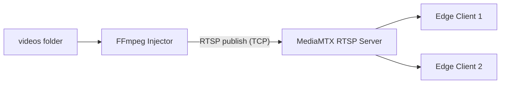

# Mock Camera Service (RTSP Stack)

This service serves files in `videos/` as real-time RTSP camera streams.
The architecture consists of two components:

- `rtsp_server` (MediaMTX): RTSP streaming server
- `stream_injector` (FFmpeg): Publisher that injects video files into the RTSP server in real time

## Architecture



## Dynamic Camera Path Rule

- Supported extensions under `videos/` are scanned: `.mp4`, `.avi`, `.mov`, `.mkv`, `.webm`
- Endpoints are assigned in alphabetical order:
  - 1st video -> `rtsp://localhost:8554/live/camera1`
  - 2nd video -> `rtsp://localhost:8554/live/camera2`
  - ...

## Why These Parameters?

`stream_injector` runs the following FFmpeg logic for each video:

- `-re`: Read video at native FPS speed (real camera behavior)
- `-stream_loop -1`: Infinite loop
- `-c:v libx264 -preset ultrafast -tune zerolatency`: Low latency
- `-b:v 2M -maxrate 2M -bufsize 1M`: Bandwidth simulation
- `-rtsp_transport tcp`: More stable transport in factory conditions

Each stream is started as a separate process; if a process crashes, the script restarts it automatically.

## Run

```bash
docker network create fall_detection_network
docker compose up -d
```

## Status Checks

```bash
docker compose ps
docker compose logs -f rtsp_server
docker compose logs -f stream_injector
```

RTSP test:

```bash
ffplay -rtsp_transport tcp rtsp://localhost:8554/live/camera1
ffplay -rtsp_transport tcp rtsp://localhost:8554/live/camera2
```

## Environment Variables (`stream_injector`)

- `VIDEO_FOLDER` (default: `/videos`)
- `RTSP_HOST` (default: `rtsp_server`)
- `RTSP_PORT` (default: `8554`)
- `RTSP_PATH_PREFIX` (default: `/live`)
- `VIDEO_BITRATE` (default: `2M`)
- `VIDEO_MAXRATE` (default: `2M`)
- `VIDEO_BUFSIZE` (default: `1M`)
- `VIDEO_PRESET` (default: `ultrafast`)
- `INJECTOR_LOG_LEVEL` (default: `info`)

## Troubleshooting

- **Green/gray corruption in image**: This may indicate UDP packet loss; connect the client via TCP.
- **Latency increases over time**: Processing speed is falling behind FPS; use a latest-frame strategy on the client.
- **Stream does not open**: Check video codec/format; H.264 is the most compatible option.
- **Stream process crashes**: Inspect error lines with `docker compose logs -f stream_injector`.
